# CI workflows

Maps which event triggers which workflow and how they call each other.

## Entrypoints

| Workflow | Trigger | What runs |
|---|---|---|
| [build-pr.yml](workflows/build-pr.yml) | `pull_request` (all branches) | ESLint + tests, PR changelog, Android + iOS store builds (gated), E2E build + Maestro shards on both platforms (gated; `e2e-shards` narrows to the sniffler-impacted shards, or skips the stage on a confident-zero diff) |
| [build-develop.yml](workflows/build-develop.yml) | `push: develop` | ESLint + tests, release changelog, Android + iOS store builds, seeds Android AVD + SDK caches for E2E shards |
| [prettier.yml](workflows/prettier.yml) | `push: * except master, develop, single-server` (main repo) | Auto-formats with Prettier + ESLint and commits any fixes back to the branch |
| [organize_translations.yml](workflows/organize_translations.yml) | `push` touching `app/i18n/locales/**.json` | Sorts JSON keys and commits the result |

## Call graph

```mermaid
flowchart TD
    classDef entry fill:#d4e6f1,stroke:#2980b9
    classDef reusable fill:#d5f5e3,stroke:#27ae60
    classDef action fill:#fef9e7,stroke:#f39c12
    classDef gate fill:#f5e6f8,stroke:#8e44ad

    PR([build-pr.yml]):::entry
    DEV([build-develop.yml]):::entry
    PRET([prettier.yml]):::entry
    TRANS([organize_translations.yml]):::entry

    ESLINT[eslint.yml]:::reusable
    CHANGELOG[generate-changelog.yml]:::reusable
    BUILDAND[build-android.yml]:::reusable
    BUILDIOS[build-ios.yml]:::reusable
    E2EAND[e2e-build-android.yml]:::reusable
    E2EIOS[e2e-build-ios.yml]:::reusable
    MASTAND[maestro-android.yml]:::reusable
    MASIOS[maestro-ios.yml]:::reusable

    SN[setup-node]:::action
    FSV[fetch-supported-versions]:::action
    GBV[generate-build-version]:::action
    AACT[build-android action]:::action
    IACT[build-ios action]:::action
    UAND[upload-android]:::action
    UIAND[upload-internal-android]:::action
    UIOS[upload-ios]:::action
    PREAND[preinstall-android-sdk]:::action
    E2EACC[e2e-account]:::action

    ESHARD[e2e-shards preflight]:::gate
    ERESULT[e2e-result required check]:::gate

    PR --> ESLINT
    PR --> BUILDAND
    PR --> BUILDIOS
    PR --> ESHARD

    ESHARD -->|should_run| E2EAND
    ESHARD -->|should_run| E2EIOS
    ESHARD -->|should_run| MASTAND
    ESHARD -->|should_run| MASIOS

    MASTAND --> ERESULT
    MASIOS --> ERESULT
    ESHARD --> ERESULT

    DEV --> ESLINT
    DEV --> CHANGELOG
    DEV --> BUILDAND
    DEV --> BUILDIOS

    PRET --> SN

    ESLINT --> SN

    BUILDAND --> SN
    BUILDAND --> FSV
    BUILDAND --> GBV
    BUILDAND --> AACT
    BUILDAND --> UAND
    BUILDAND --> UIAND

    BUILDIOS --> SN
    BUILDIOS --> FSV
    BUILDIOS --> GBV
    BUILDIOS --> IACT
    BUILDIOS --> UIOS

    E2EAND --> SN
    E2EIOS --> SN

    MASTAND --> PREAND
    MASTAND --> E2EACC

    MASIOS --> E2EACC
```

## Manual gates

| Environment | Workflow / job | Fires when |
|---|---|---|
| `android_build` | [build-android.yml](workflows/build-android.yml) — `build-hold` | Called with `trigger == pr` (i.e. from `build-pr.yml`) |
| `upload_android` | [build-android.yml](workflows/build-android.yml) — `upload-hold` | Called with `trigger == pr`, after the Android build completes |
| `ios_build` | [build-ios.yml](workflows/build-ios.yml) — `build-hold` | Called with `trigger == pr` (i.e. from `build-pr.yml`) |
| `approve_e2e_testing` | [build-pr.yml](workflows/build-pr.yml) — `e2e-hold` | A `pull_request` run whose diff impacts at least one Maestro flow (`e2e-shards` sets `should_run == true`). A confident-zero diff skips the whole e2e stage, so no approval fires. |
