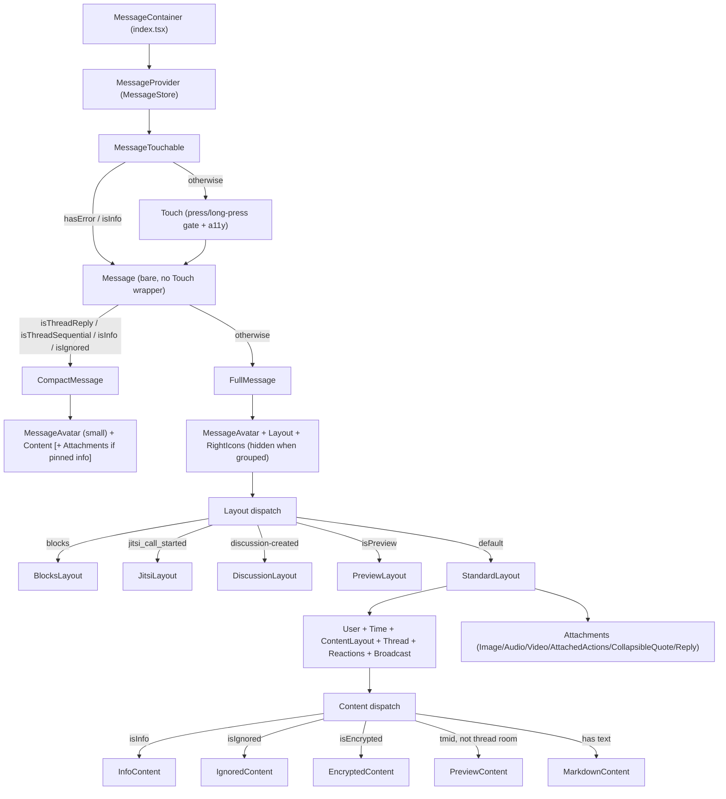

# Message Component Architecture

Load-bearing reference for `app/containers/message/`: how one Message row is provided, composed, and rendered. Domain terms (**Message Action**, **Message Action State**, **Positional State**, **Message Preview**) are defined in the repo glossary `CONTEXT.md` — this document uses them as defined there. Post-refactor (PR #7455): the module moved from a single class-component prop chain to three scoped Zustand stores plus a function-component render tree.

---

## Purpose & entry point

The module renders **one Message row**. The public entry point is the default export of `app/containers/message/index.tsx`:

```tsx
<MessageProvider item previousItem onPress onLongPress threadBadgeColor isIgnored>
	<MessageTouchable isPreview highlighted />
	<MessageSeparator ts unread />
</MessageProvider>
```

`MessageProvider` seeds the per-row `MessageStore` (see below); `MessageTouchable` is the pressable row itself; `MessageSeparator` (a sibling, not part of this module) renders the date/unread divider above the row.

This default export is consumed as `renderRow` from three list contexts — `RoomView` (the main Message Window), `MessagesView` (pinned/starred lists), `SearchMessagesView` (search results) — plus one non-list context: `components/Preview.tsx` wraps a single Message with its own `MessageRoomProvider` for a **Message Preview** rendered outside a Room (forward-message target picker, quoted-message preview in markdown). A `highlighted` boolean and `isPreview` flag are the only pieces of **Positional State** and preview-mode state this module receives from its caller — the Message Window itself (jump target, scroll position) is owned by `RoomView`, not here.

---

## The three stores

| Store                  | File                            | Scope                                                              | Provider mounted at                                                                                          | Lifetime                  |
| ---------------------- | ------------------------------- | ------------------------------------------------------------------ | ------------------------------------------------------------------------------------------------------------ | ------------------------- |
| **MessageStore**       | `stores/MessageStore.tsx`       | One Message record (`item`) + its previous neighbor                | `index.tsx`, once per row                                                                                    | Row mount → unmount       |
| **MessageRoomStore**   | `stores/MessageRoomStore.tsx`   | Room-scoped context: handlers, `rid`, `baseUrl`, user, settings    | `RoomView`, `MessagesView`, `SearchMessagesView`, `ModalBlockView`, `Preview.tsx` — wraps the whole list/row | Room/view mount → unmount |
| **MessageActionStore** | `stores/MessageActionStore.tsx` | The active **Message Action** (Quote/Edit/React) and its target(s) | `RoomView` only, via `RoomProviders` — one per Room, wraps List **and** the composer                         | Room mount → unmount      |

### Why three, not one

Each store changes at a different frequency and has a different audience, and collapsing them would force every row to re-render on changes it doesn't care about:

- **MessageStore** changes per-row, on that row's own WatermelonDB record emitting (`experimentalSubscribe`) — a `tick` counter bumps and only that row's selectors re-run. `previousItem` doubles as the neighbor lookup used by grouping/thread-position logic.
- **MessageRoomStore** is mostly static for the life of a Room: navigation callbacks, `rid`, `baseUrl`, and the logged user are captured once (see `FROZEN_KEYS`) and never resynced, because they're expected to be referentially stable for the Room's lifetime. A second, explicitly reactive tail (`timeFormat`, `autoTranslateRoom`, `autoTranslateLanguage`, `archived`, `broadcast`, `isReadReceiptEnabled`, `Message_GroupingPeriod`) is pushed on every render via a dependency-gated `useEffect`, because those _can_ change mid-session (e.g. a Room gets archived).
- **MessageActionStore** is shared Room-wide state that both the Message list (to highlight the row being edited) and `MessageComposer` (to know what's being quoted/edited) read — it has to live above both, not per-row.

### Granular selectors + `useShallow` + React Compiler

Every store exposes narrow, single-purpose hooks (`useReactions`, `useBlocks`, `useMessageAuthor`, `useIsEncrypted`, …) instead of one broad "give me the message" hook — each leaf component subscribes to only the fields it renders, so a field it doesn't use changing elsewhere on the record never re-renders it. Hooks returning more than one field use Zustand's `useShallow` so a same-value re-tick doesn't produce a new object reference (`useBlocks`, `useThreadData`, `useMessageAuthor`, `useContentData`, etc.). Memoization comes from React Compiler (`babel-plugin-react-compiler`, `compilationMode: 'infer'`) rather than hand-written `useMemo`/`useCallback`.

Two dev-only guards protect this pattern from silent regressions (both no-op in production builds):

- `useMessageFieldDev` (MessageStore) warns once if a `useMessageField` selector returns a fresh-but-shallow-equal object/array on an unchanged tick — a sign someone wrote an inline `item => ({ a: item.a })` instead of a `useShallow` domain hook. Field stability itself depends on the model's `@json(..., { memo: true })` decorators (`app/lib/database/model/Message.js`), guarded separately by `Message.memo.test.ts`.
- `useFrozenHandlersGuardDev` (MessageRoomStore) warns once if any `FROZEN_KEYS` value's identity changes after mount, since the provider captures those once and never re-syncs them.

### Inert-store fallback vs. throwing

Rows can render outside a full provider stack (a **Message Preview** has no `MessageActionProvider`; some tests mount only `MessageStore`/`MessageRoomStore`). The three stores disagree deliberately on how to fail:

- **MessageStore** and **MessageRoomStore** hooks throw (`'Message hooks must be used within a MessageProvider'` / `'...MessageRoomProvider'`) if no provider is present — every row and every Room-scoped view is expected to always supply both.
- **MessageActionStore** distinguishes by hook: `useMessageAction()` throws without a provider, but `useIsBeingEdited(messageId)` falls back to a shared `inertStore` (`action: null`, and every action method throws `NO_OP_ACTIONS`) — a Message Preview rendered without a `MessageActionProvider` can ask "am I being edited?" and safely get `false` instead of crashing, since it can never actually enter an edit session.

---

## Component composition



- **MessageTouchable** (`components/Touchable/MessageTouchable.tsx`) is the press/long-press gate and the a11y surface for the row: it reads `useMessageTouchable()`'s derived `tappable`/`longPressable`/`revealsIgnored` flags plus `useIsBeingEdited` (for the edit-mode highlight color) and builds the accessibility label/hint/actions. Error and Info Messages skip the `Touch` wrapper entirely — the whole row isn't pressable, though sub-elements (links, attachments) still are through their own handlers.
- **`Touch`** (`components/Touchable/Touch.tsx`) is the actual platform touchable (`TouchableOpacity` on iOS, `TouchableHighlight` on Android) wrapped for `react-native-external-keyboard` D-pad focus; it carries no Message-specific logic.
- **`Message`** (`components/Message/Message.tsx`) is the density switch: `CompactMessage` for a **Thread Message**'s in-parent-room preview (`isThreadReply`/`isThreadSequential`), an **Info Message**, or an Ignored Message; `FullMessage` otherwise.
- **`FullMessage`** renders the avatar, dispatches to `Layout`, and appends `RightIcons` only when the row shows its own **Message Header** (`!isHeader` from `useMessageGrouping`) — a **Grouped Message** has no right-icon row.
- **`CompactMessage`** renders a small avatar and `Content` directly (no `Layout` dispatch), with an extra read-only `Attachments` render for a pinned Info Message (`t === 'message_pinned'`) and an optional `RepliedThread` header when it's the first Thread Message in a run.
- **`Layout`** (`components/Layout/index.tsx`) picks among `BlocksLayout` (a Blocks Message from an App), `JitsiLayout`/`DiscussionLayout` (their respective System Message types), `PreviewLayout` (a **Message Preview**), and `StandardLayout` (everything else), all wrapped in `WidthAwareView` for width-dependent children (images, markdown wrapping).
- **`Content`** (`components/Content/index.tsx`) is a second, narrower dispatch inside `StandardLayout`/`PreviewLayout`/`CompactMessage` for the body itself: Info → Ignored → Encrypted → thread-preview (`PreviewContent`, only outside a Thread room) → markdown, in that priority order.
- **`Attachments`** (`components/Attachments/Attachments.tsx`) filters to non-quote attachments and maps each to `Image`/`Audio`/`Video`/`AttachedActions`/`CollapsibleQuote`/`Reply` by shape (`image_url`, `audio_url`, `video_url`, `actions`, `collapsed`, nested `attachments`).
- **`RightIcons`** (`components/RightIcons/index.tsx`) is a flat row of independent flag icons — `Pinned`, `Encrypted`, `Edited`, `MessageError`, `Translated`, `ReadReceipt` — each reading its own MessageStore/MessageRoomStore slice.
- **`MessageActionTouchable`** (`components/Touchable/MessageActionTouchable.tsx`) is a smaller building block (a `Pressable` wired to `useMessageLongPress`) reused by several leaf components (Reactions, Thread, Discussion, Broadcast, attachment sub-views) that need the row's long-press behavior without being the row's own top-level touchable.

---

## Vocabulary alignment

`TMessageActionState` (`definitions/IMessage.ts`) is `{ kind: 'edit' | 'quote' | 'react', ... } | null` — this matches CONTEXT.md's **Message Action** definition exactly (Quote, Edit, React; no "reply" action). `MessageActionStore`'s `action` field is the **Message Action State** as defined in the glossary; the retired term "interaction" does not appear anywhere in this module's stores or hooks. **Positional State** (highlight, jump/scroll position) is not owned here — it arrives as the plain `highlighted` prop threaded down from `RoomView`'s list.

**Known follow-up:** `MessageRoomState`'s handler/constant fields are all individually optional (`?`), which is looser than the shape the values actually have once mounted (all frozen fields are supplied together). A future pass may flatten this to a non-optional shape post-mount; as of this refactor it remains all-optional.
