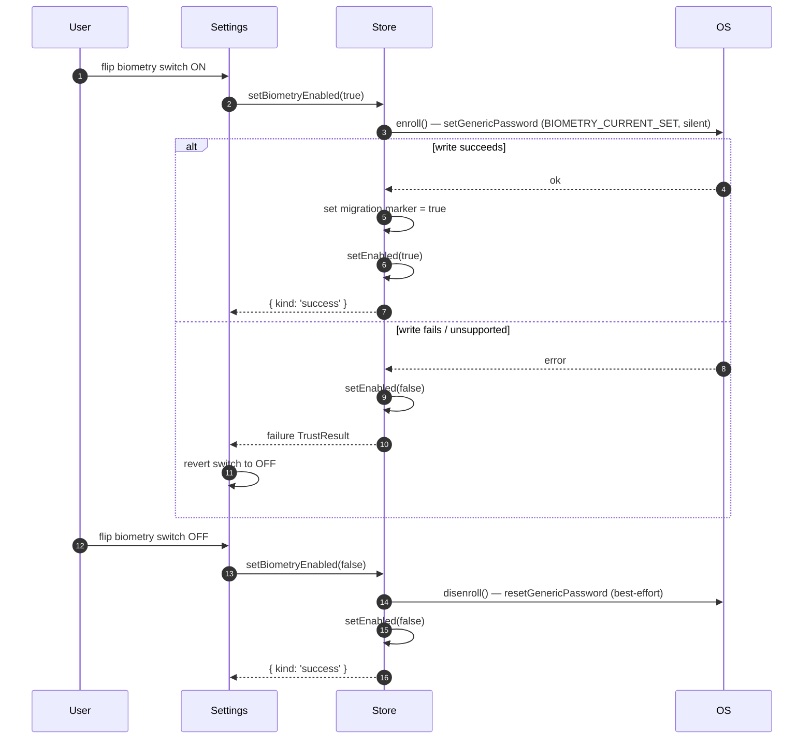
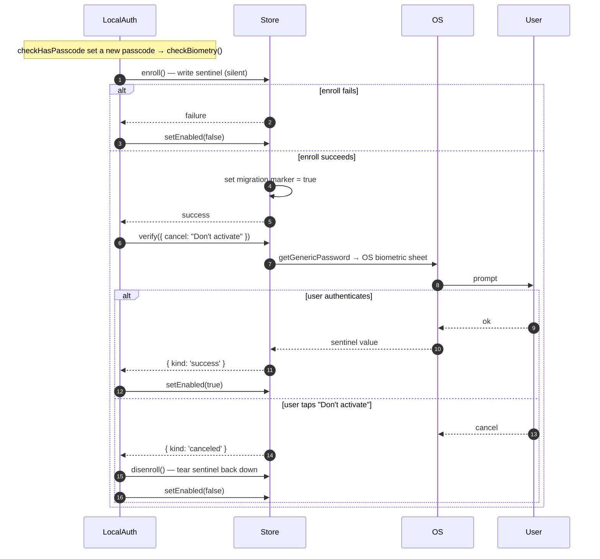
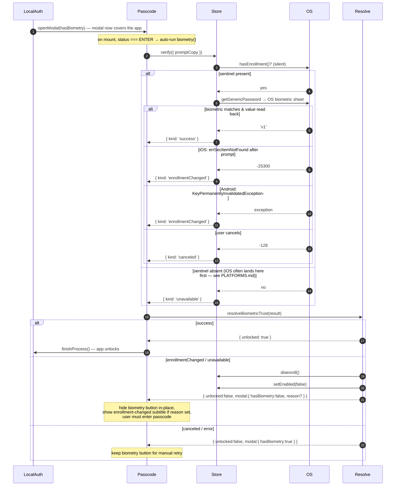
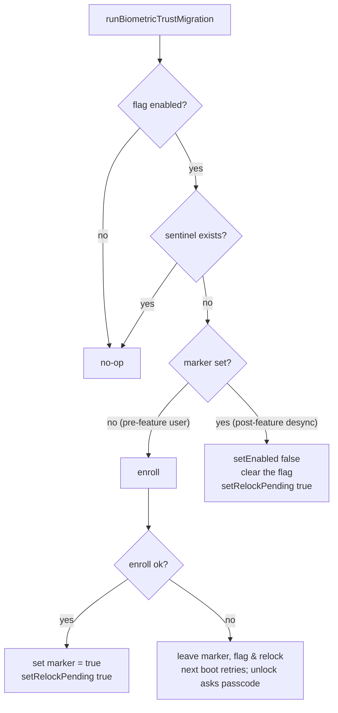

# Biometric Trust Store Flows

Sequence diagrams for the handshakes between the screen-lock UI, the trust store, and the OS keychain. Each diagram describes ordering and ownership; method signatures live in the code, not here. Read `ARCHITECTURE.md` first — these diagrams use its vocabulary (sentinel, flag, marker, `TrustResult` kinds).

Participants used below:

- **Settings** — `ScreenLockConfigView.tsx`
- **Passcode** — `PasscodeEnter.tsx`
- **LocalAuth** — `methods/helpers/localAuthentication.ts`
- **Store** — `biometricTrustStore` (`index.ts`)
- **Resolve** — `resolveBiometricTrust.ts`
- **OS** — `react-native-keychain` → platform keychain / keystore

---

## 1. Enable / disable from the settings toggle

`toggleBiometry` routes the whole on/off operation through `setBiometryEnabled`, which keeps the keychain and the flag in sync and reports failure so the switch can roll back.

Note the enable path does **not** prompt for biometrics — writing the sentinel is silent. The toggle treats "sentinel written" as enough; explicit consent is only required on the first-passcode opt-in (flow 2), where there is no prior screen-lock context.

---

## 2. First-passcode opt-in (`checkBiometry`)

When the user sets their first passcode, screen lock asks whether to also enable biometric unlock. Because `enroll()` is silent, consent is captured with a **second** call — a `verify()` prompt — and the sentinel is torn down if the user declines.

The `verify()` here doubles as the consent prompt: succeeding means the user agreed _and_ proved the current enrollment works; declining opts out and cleans up.

---

## 3. Auto-unlock and enrollment-change detection

The most security-sensitive flow. When auto-lock fires, `handleLocalAuthentication` opens the passcode modal **first** so the app content is covered, then `PasscodeEnter` prompts biometry from _behind_ the modal. Prompting before the modal exists would flash the app content under the OS sheet and defeat screen lock.

`PasscodeEnter` mirrors `hasBiometry`/`reason` in local state so an invalidation hides the button **within the same modal session** without re-emitting `LOCAL_AUTHENTICATE_EMITTER` (which would orphan the upstream `openModal` promise).

---

## 4. Init-time migration

Runs once per launch from the `restore` saga, before any server/user restoration. Pure decision over flag/sentinel/marker — see the truth table in `ARCHITECTURE.md`.

The grandfather branch (`marker = no`) is reachable only by users who enabled biometry before the sentinel feature existed. Every app-driven `enroll()` sets the marker, so post-feature users with a missing sentinel always reach the reconciliation branch instead — closing the silent re-bind.

Both the grandfather and reconciliation branches set the **relock marker**. The freshly-bound grandfather baseline is untrusted — there was no prior enrollment to compare against, so an attacker who altered the enrollment before this first upgrade would otherwise be silently trusted (on Android the native probe can't catch this either: with no key yet, `isEnrollmentValid()` just creates a fresh baseline and reports valid). The migration runs **before** `localAuthenticate`, so it persists the relock marker; the next unlock (§3) reads it (OR-ed with the live enrollment-change check), forces the passcode regardless of the auto-lock window, and clears it once the modal is shown.
