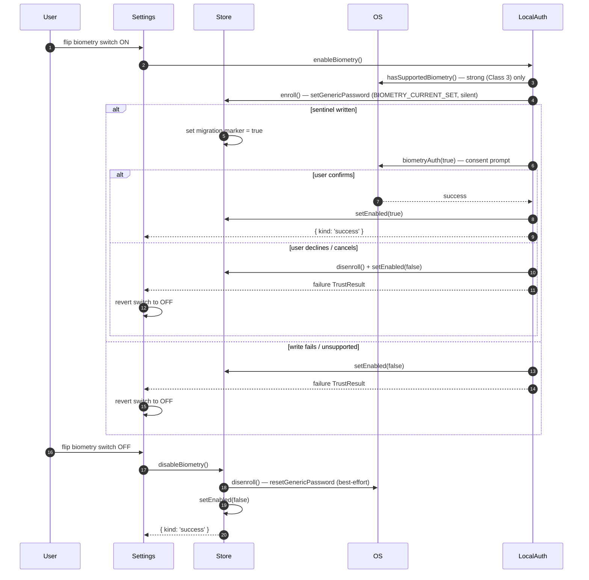
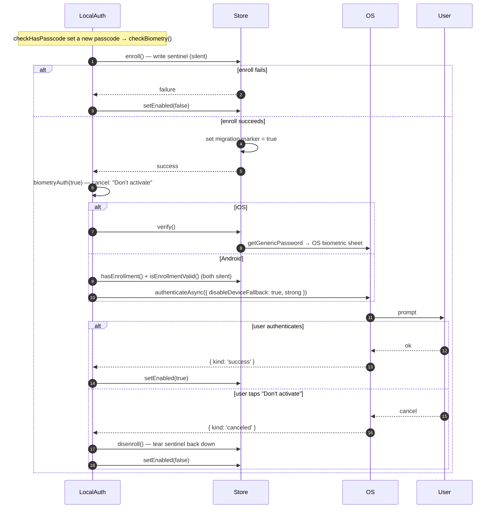
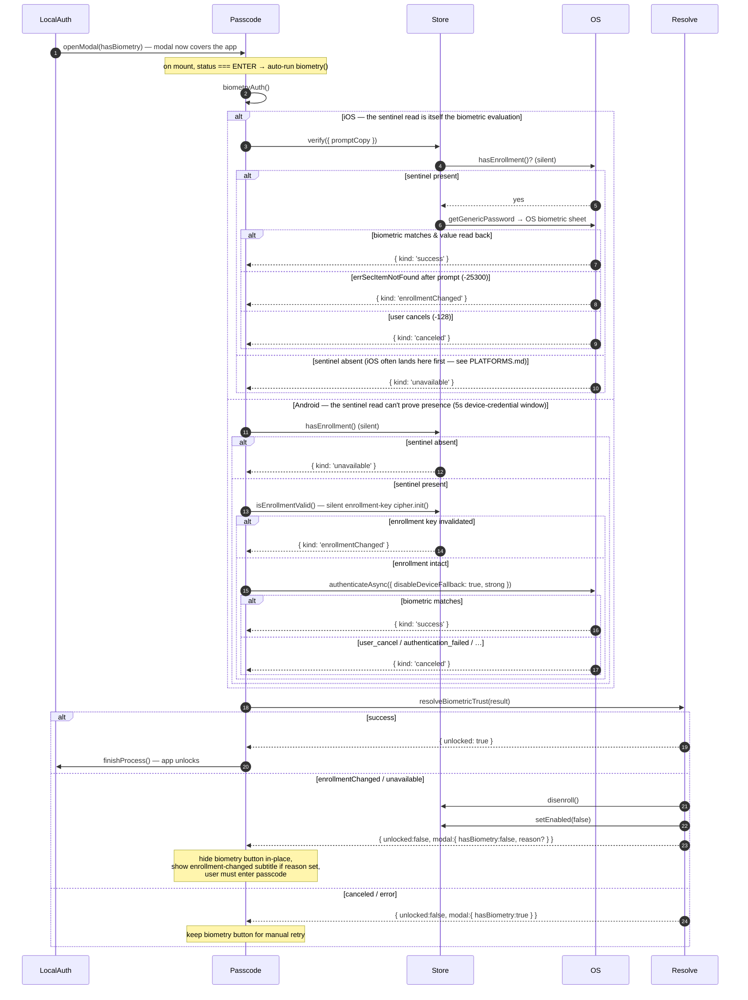
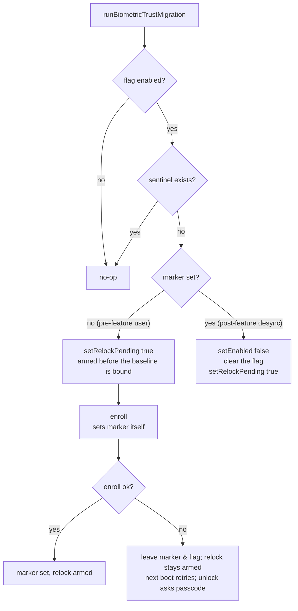

# Biometric Trust Store Flows

Sequence diagrams for the handshakes between the screen-lock UI, the trust store, and the OS keychain. Each diagram describes ordering and ownership; method signatures live in the code, not here. Read `ARCHITECTURE.md` first — these diagrams use its vocabulary (sentinel, flag, marker, `TrustResult` kinds).

Participants used below:

- **Settings** — `ScreenLockConfigView.tsx`
- **Passcode** — `PasscodeEnter.tsx`
- **LocalAuth** — `methods/helpers/localAuthentication.ts`
- **Store** — `biometricTrustStore` (`index.ts`)
- **Resolve** — `resolveBiometricTrust.ts`
- **OS** — `react-native-keychain` → platform keychain / keystore

---

## 1. Enable / disable from the settings toggle

`toggleBiometry` enables through `enableBiometry` (the shared enroll-then-consent path, §2) and disables through `disableBiometry()`. Either way the keychain and the flag stay in sync; only the enable path can fail, and it reports the failure so the switch can roll back.

Note the enable path **does** prompt: writing the sentinel is silent, so it cannot stand in for consent. This matters most for the grandfathered cohort, whose baseline was torn down by the migration (flow 4) and who re-enable through exactly this toggle — binding a new baseline without a prompt would hand trust back to whatever enrollment is currently on the device.

---

## 2. First-passcode opt-in (`checkBiometry` → `enableBiometry`)

When the user sets their first passcode, screen lock asks whether to also enable biometric unlock. Because `enroll()` is silent, consent is captured with a **second** call — a `biometryAuth(true)` prompt — and the sentinel is torn down if the user declines.

The prompt here doubles as the consent gate: succeeding means the user agreed _and_ proved the current enrollment works; declining opts out and cleans up. It must go through `biometryAuth` rather than `verify()` — on Android a bare `verify()` can resolve inside the keystore's 5s auth window with no prompt shown, which would enable biometric unlock without ever asking. See `PLATFORMS.md`.

---

## 3. Auto-unlock and enrollment-change detection

The most security-sensitive flow. When auto-lock fires, `handleLocalAuthentication` opens the passcode modal **first** so the app content is covered, then `PasscodeEnter` prompts biometry from _behind_ the modal. Prompting before the modal exists would flash the app content under the OS sheet and defeat screen lock.

`PasscodeEnter` mirrors `hasBiometry`/`reason` in local state so an invalidation hides the button **within the same modal session** without re-emitting `LOCAL_AUTHENTICATE_EMITTER` (which would orphan the upstream `openModal` promise).

---

## 4. Init-time migration

Runs once per launch from the `restore` saga, before any server/user restoration. Pure decision over flag/sentinel/marker — see the truth table in `ARCHITECTURE.md`.

The grandfather branch (`marker = no`) is reachable only by users who enabled biometry before the sentinel feature existed. Every app-driven `enroll()` sets the marker, so post-feature users with a missing sentinel always reach the reconciliation branch instead — closing the silent re-bind.

Both the grandfather and reconciliation branches set the **relock marker** — and the grandfather branch sets it _first_, before `enroll()` binds anything, so a crash can never leave a trusted baseline with no debt recorded (see ARCHITECTURE.md, "Ordering is load-bearing"). The freshly-bound grandfather baseline is untrusted — there was no prior enrollment to compare against, so an attacker who altered the enrollment before this first upgrade would otherwise be silently trusted. No lower layer can catch that: binding a baseline is not validating one, and the enrollment-change primitives only report that nothing changed _since_ the bind. The migration runs **before** `localAuthenticate`, so it persists the relock marker; the next unlock (§3) reads it (OR-ed with the live enrollment-change check), forces the passcode regardless of the auto-lock window, and clears it once the modal is shown. That forced unlock routes through the same `enrollmentChanged` branch as a real change, so it also tears the migration-bound sentinel back down (`disenroll()`) and clears the biometry flag (`setEnabled(false)`) — the grandfather baseline is never trusted, and the user re-opts into biometry from settings afterward. See ARCHITECTURE.md, "Why the grandfather path forces a passcode."
