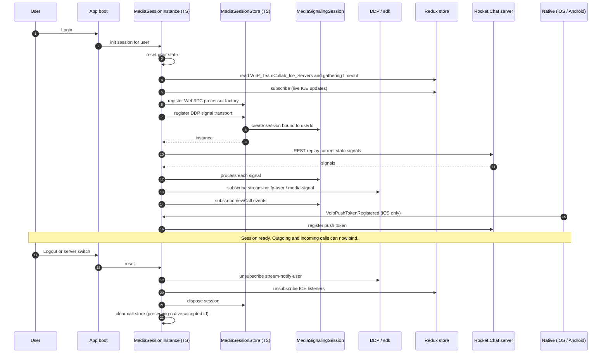
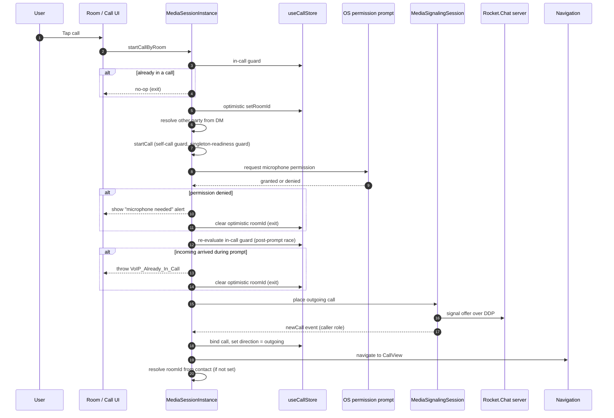
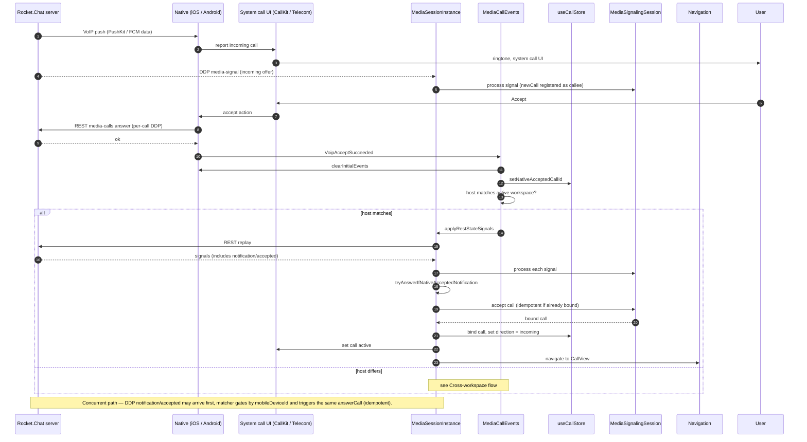
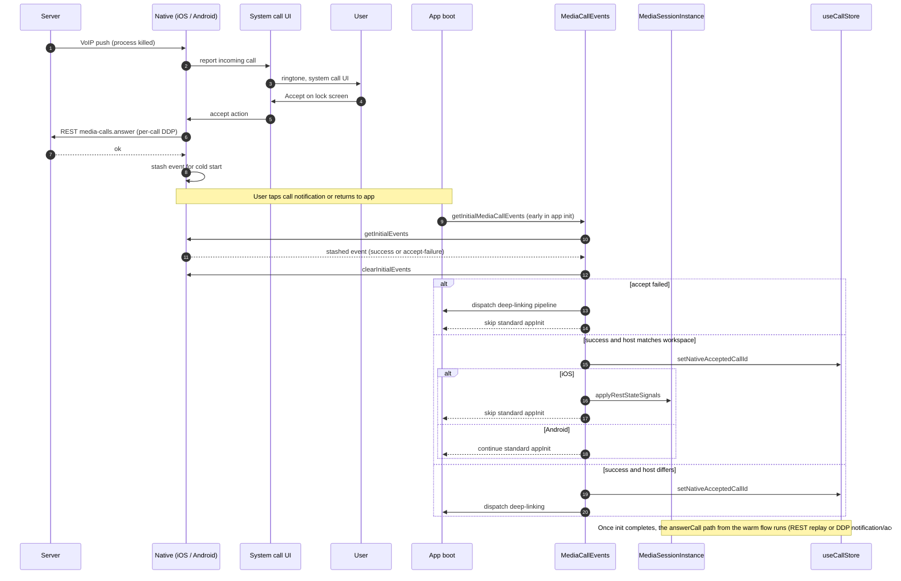
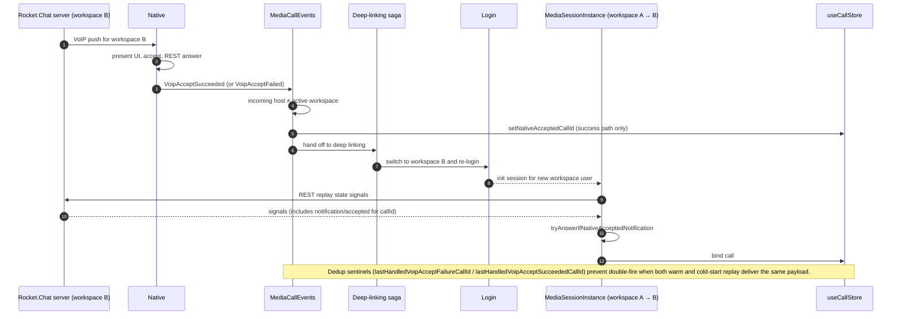
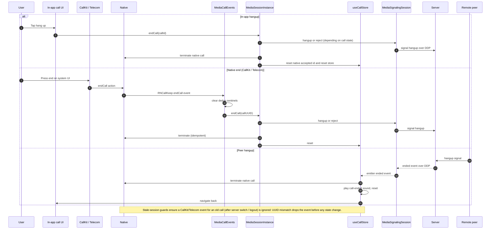

# VoIP Flows

Cross-runtime sequence diagrams for the handshakes that span TypeScript, Swift, and Kotlin. Each diagram describes ordering and ownership transfer; method signatures and parameter names live in the code, not here. Read `ARCHITECTURE.md` first.

---

## 1. Init and teardown

Login establishes the singleton; logout or server switch tears it down. The DDP listener and Redux subscriptions live for the duration of the session.

_Last verified: cd2faa00a_

---

## 2. Outgoing call

User taps "call" on a DM. The path passes through the in-call guard, the permission prompt, and a second in-call check before the signaling session is asked to place the call. The race window is the permission prompt: an incoming call can arrive while the user reads the dialog.

_Last verified: cd2faa00a_

---

## 3. Incoming call — warm (app foreground)

The signaling session sees the call first via DDP. Native still owns the system call UI and still issues the REST accept, but JS is alive throughout, so the warm path converges quickly. `answerCall` is idempotent; the DDP `notification/accepted` and the REST replay race harmlessly.

_Last verified: cd2faa00a_

---

## 4. Incoming call — cold start (app killed)

App process is not running. The push wakes native, which presents the system UI and accepts before JS exists. JS boots later and reconciles via the initial-events handoff. iOS and Android diverge: iOS replays REST signals immediately and skips the standard app init; Android proceeds with app init, which carries the call state forward.

_Last verified: cd2faa00a_

---

## 5. Cross-workspace incoming

A push for a workspace the user is not currently in (or accept failed entirely) needs to switch the active server before binding the call. The deep-linking saga owns the workspace switch; VoIP hands off and waits for the rebound session.

_Last verified: cd2faa00a_

---

## 6. End call

Three origins converge on the same cleanup. Whoever sees the end first tells the other side, the call store resets, and native is told to drop the system UI.

_Last verified: cd2faa00a_

---

## Audio control sync

Audio controls are not a sequence diagram — they are short bidirectional handshakes between the OS audio stack, the native module, and the JS store. The invariants in `ARCHITECTURE.md` cover the loop-breaking guards.

### Mute

- **JS → OS** — user taps the mute button. `useCallStore.toggleMute` updates the call participant and the local mirror; CallKit/Telecom learn via the underlying transport.
- **OS → JS** — OS issues `didPerformSetMutedCallAction` (e.g. user mutes from Control Center). The listener compares the event's call UUID to the active call UUID, ignores stale sessions, and only calls `toggleMute()` when `muted !== isMuted` (echo guard).

### Hold

Two distinct flows share the same OS event:

- **Auto-hold** — a competing CallKit/Telecom call (e.g. a regular phone call) forces the VoIP call onto hold. The listener sees `hold = true`, calls `toggleHold()`, and sets `wasAutoHeld = true`. When the OS resumes (`hold = false`), the listener auto-resumes only if `wasAutoHeld` was set.
- **Manual hold** — user toggles hold from the in-app UI. `useCallStore.toggleHold` flips state. The OS event (if any) is reconciled; `wasAutoHeld` is not set, so when the user toggles back the auto-resume branch does not run.

### Speaker

Platform-specific:

- **iOS** — `InCallManager.setForceSpeakerphoneOn` toggles between the receiver and speaker.
- **Android** — `NativeVoipModule.setSpeakerOn` drives `AudioManager` directly. `startAudioRouteSync` registers an OS listener that emits `VoipCommunicationDeviceChanged { isSpeaker }` whenever the route changes. The JS handler mirrors `isSpeakerOn` only when a call is bound; otherwise the event is dropped.

_Last verified: cd2faa00a_
