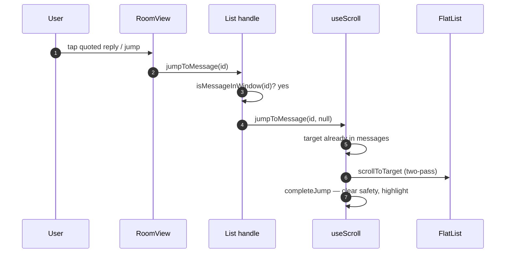
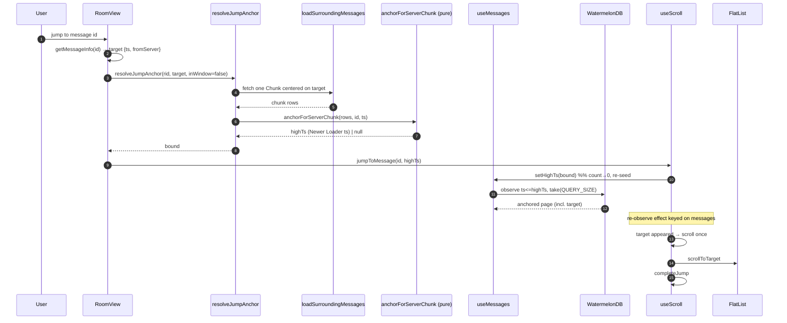
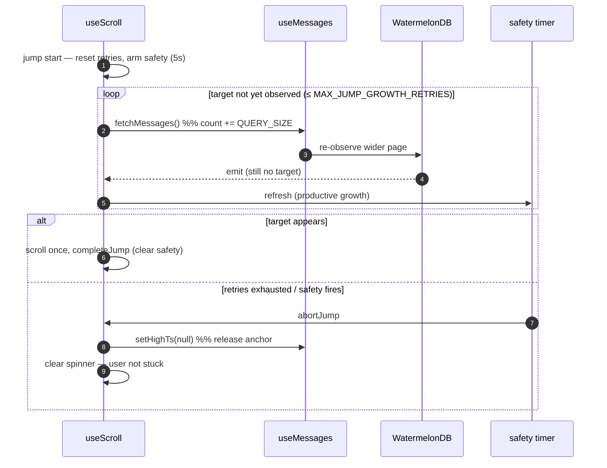
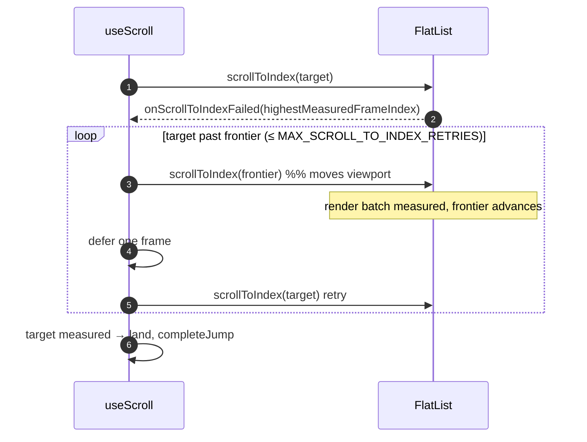
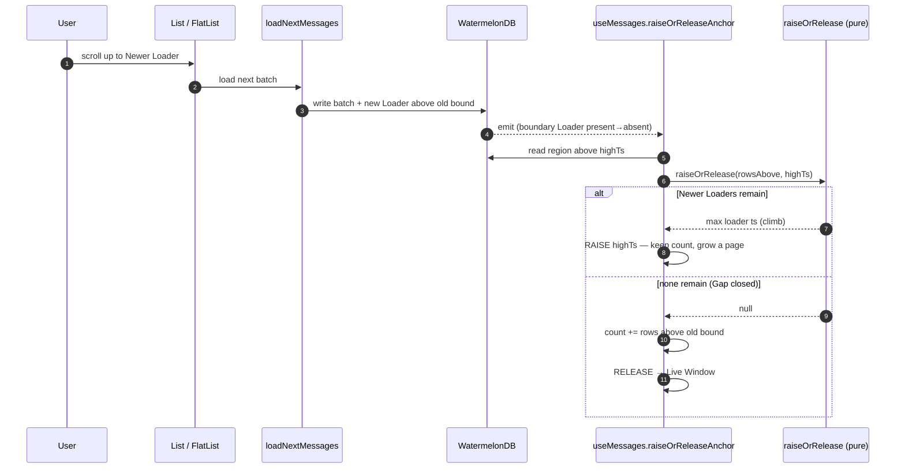
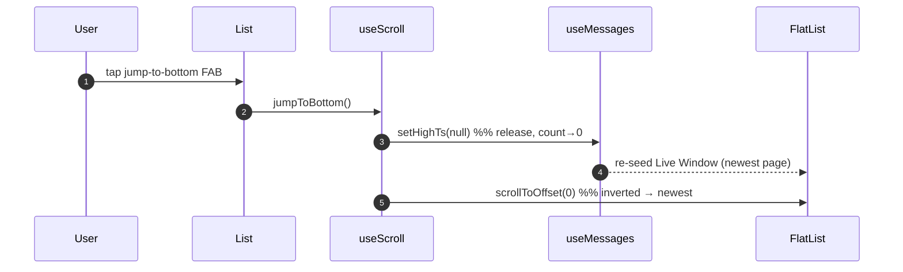

# Room Message Loading Flows

Sequence diagrams for the jump and window-management handshakes that span `RoomView`, the `List` hooks, the pure anchor resolvers, and WatermelonDB. Each diagram describes ordering and ownership; method signatures and parameter names live in the code, not here. Read `ARCHITECTURE.md` first — these diagrams assume its vocabulary (Message Window, Live Tail, Anchored Window, Newer Loader, `highTs`).

---

## 1. Jump to a target already in the window

The cheapest path: a nearby quoted reply or a target the rendered window already contains. No anchoring, no I/O — scroll in place.



_Last verified: f78d6a37c_

---

## 2. Jump to a server-fetched target (anchored)

Target not in the window and not cached. Resolve a bound from a freshly fetched Chunk, re-seed the window, await the re-observe, scroll once.



_Last verified: f78d6a37c_

---

## 3. Deep target — growth retries and the safety net

A target whose first anchored page does not yet contain it. The re-observe effect grows the window a page at a time, bounded, refreshing the safety net on each productive growth. An unreachable target aborts and releases the anchor.



_Last verified: f78d6a37c_

---

## 4. Scroll landing — frontier climb

The inverted list has no `getItemLayout`, so `scrollToIndex` cannot reach an unmeasured frame. On failure, step to the measured frontier (which advances it a render batch), then re-attempt — deferred one frame to break `VirtualizedList`'s synchronous re-fire, capped at `MAX_SCROLL_TO_INDEX_RETRIES`.



_Last verified: f78d6a37c_

---

## 5. Rejoin the Live Tail — raise / release climb

The user scrolls up from an Anchored Window and resolves "Load newer" Loaders. Each consumed boundary Newer Loader either raises the bound toward live or releases the window once the Gap closes.



_Last verified: f78d6a37c_

---

## 6. Jump to bottom (rejoin live via FAB)

The Anchored Window forces the jump-to-bottom FAB visible (the loaded rows' bottom edge isn't the Live Tail). Tapping it releases the anchor and scrolls to the newest Message.



_Last verified: f78d6a37c_

---

## 7. Thread jump timing

A thread jump must fire after the thread rows load, not at mount. Firing early aborts on the safety net and parks on the Live Tail. The param is read-and-cleared so concurrent `init()` callers cannot re-fire it.

```mermaid
sequenceDiagram
    autonumber
    participant Nav as navigation param
    participant RV as RoomView
    participant Init as init()
    participant Thread as loadThreadMessages
    participant List as List handle

    Nav->>RV: jumpToMessageId (thread target)
    RV->>RV: componentDidMount — main-list jump fires now; thread jump deferred
    RV->>Init: init()
    Init->>Thread: loadThreadMessages
    Thread-->>Init: thread rows present
    Init->>RV: read-and-clear jumpToMessageId
    RV->>List: jumpToMessage(id)  %% rows exist → lands
```

_Last verified: f78d6a37c_
